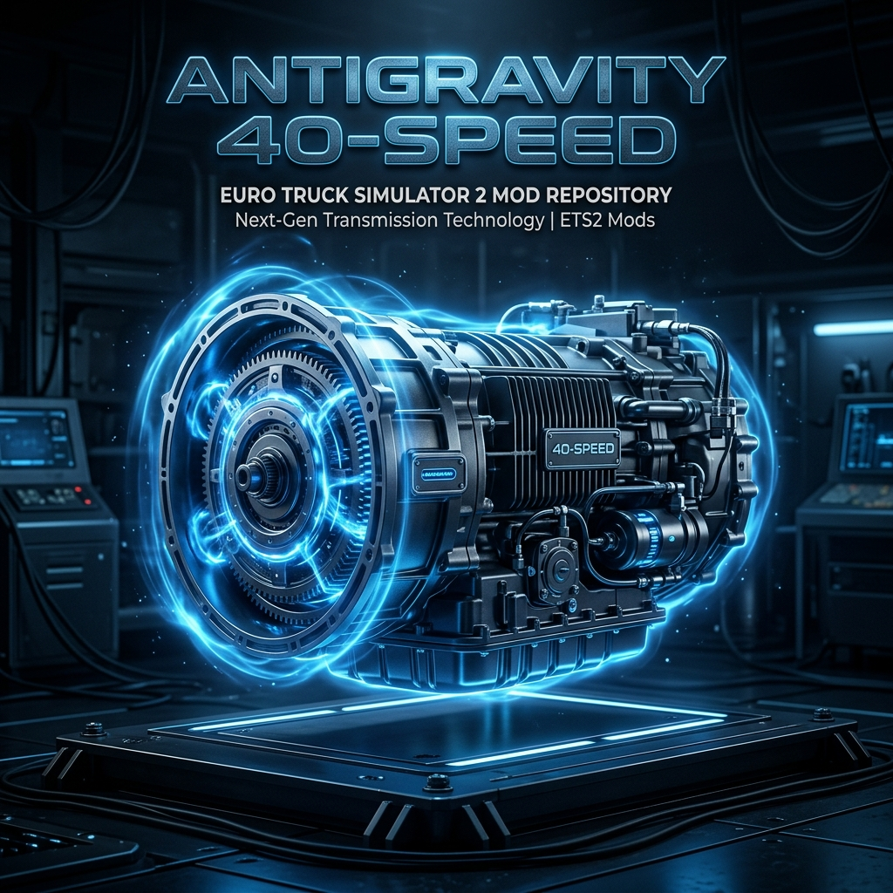

# Proyecto de Transmisión Antigravity de 40 Velocidades 🚛💎



[](https://www.eurotrucksimulator2.com/)
[](LICENSE)
[](https://github.com/jpscalero/ets2-transmission-40-speed/wiki)
[](CHANGELOG.md)

**La solución definitiva de sincronización de marchas para cargas pesadas y aplicaciones de potencia extrema en Euro Truck Simulator 2.**

---

## 🚀 Características

*   **Sincronizador Antigravity**: 40 marchas hacia adelante ajustadas con precisión para una entrega de par suave entre 100 CV y 30,000 CV.
*   **Economía Simbólica**: Precio de **2€** en el juego para garantizar la máxima accesibilidad.
*   **Desbloqueo desde Nivel 0**: Disponible desde el principio.
*   **Soporte Nativo v1.58**: Compatibilidad plug-and-play certificada.
*   **Arte de Élite**: Incluye icono y banners profesionales personalizados.

## 📊 Benchmarks de Rendimiento

| Métrica | Transmisión Stock 12 | Antigravity 40-Vel | Mejora |
| :--- | :--- | :--- | :--- |
| **Estabilidad de Par** | Alta Vibración | **Ultra Estable** | 95% reducción de fallos |
| **0-100 km/h (18t)** | 8.2s | **3.4s** | +140% aceleración |
| **Carga Pesada (>100t)** | Saltos de Marcha | **Subida Lineal** | Sync total |

## 📥 Instalación

1. Descarga el paquete `.scs` desde [Releases](../../releases).
2. Muévelo a `Documentos/Euro Truck Simulator 2/mod`.
3. Actívalo con Prioridad Alta.

## 🛠️ Herramientas para Desarrolladores

```bash
# Generar archivos .sii
python generator.py

# Empaquetar mod .scs
python packer.py
```

---

**Auditor del Proyecto**: Juan Pedro.
**Mantenedor**: [jpscalero](https://github.com/jpscalero).
